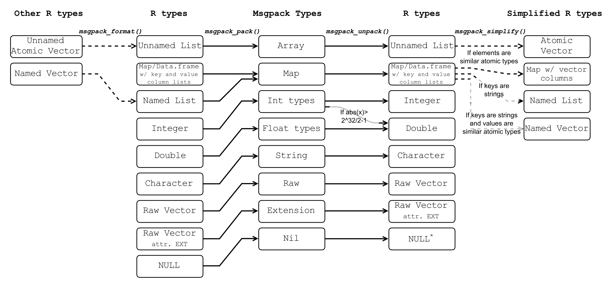

# msgpack2R
*Convert to and from msgpack objects in R.*


A flowchart describing the conversion of R objects into msgpack objects and back.  

Msgpack extensions are converted to raw vectors with EXT attributes containing the extension type.  The extension type must be an integer from 0 to 127.  

Maps are converted to data.frames with additional class "map".  Map objects in R contain key and value list columns and can be simplified to named lists or named vectors.  The helper function `msgpack_map` can create map objects that can be serialized into msgpack.  

### Installation:
1. On Windows, install Rtools (https://cran.r-project.org/bin/windows/Rtools/)
2. In R, install devtools: install.packages("devtools")
3. library(devtools)
4. install_github("traversc/msgpack2R")

### Example:
See tests.r for more examples.  
```
library(msgpack2R)
x <- as.list(1:1e7)
# Serialize to msgpack
xpk <- msgpack_pack(x)
# De-serialize to R
xu <- msgpack_unpack(xpk)
```
